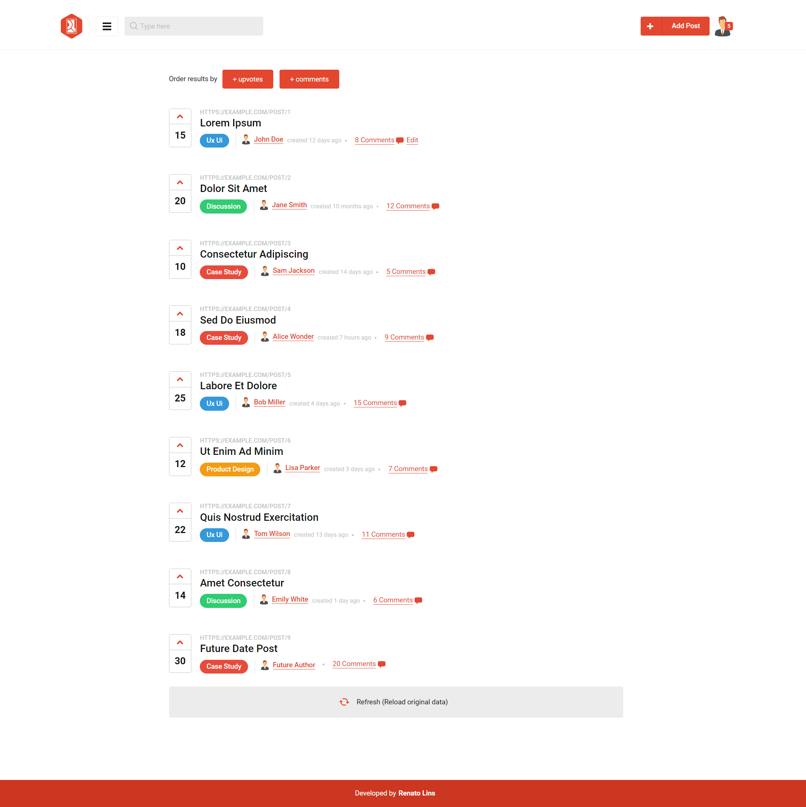

# Reddit-like App

A challenge-based application showcasing how modular component architecture and Redux state management can work together to recreate interfaces similar to the classic version of Reddit.



## Getting started

```bash
npm install
npm run dev      # development
npm run build    # production build
npm test         # run tests
```

## Stack

- React 19 + TypeScript
- Redux Toolkit
- Styled Components
- Sass (global styles)
- Vite (build tool)
- Vitest (tests)

## Project structure

- **domain/** — main app module (components, data, models, images). Add new top-level folders per domain as the app grows (e.g. `users/`, `payment/`).
- **shared/** — reusable components, hooks, icons, models and helpers not tied to any domain. Designed to eventually become a private internal library.
- **global-styles/** — CSS resets and base typography.
- **theme/** — design tokens for a themeable approach (supports dark/light mode or multi-theme setups).

## Images

Images live inside their domain/module folder rather than a global assets folder. The `<Image>` component resolves local images via `import.meta.glob` using paths configured in `.env`:

```env
VITE_SHARED_IMAGES_PATH=src/shared/images
VITE_DOMAIN_IMAGES_PATH=src/domain/images
```

## State & data

- Mock data is used throughout — no real API.
- A fake user is stored in Redux to illustrate auth-like patterns.
- Filtering and ordering happen client-side on top of the fetched data copy.

## Responsiveness

Handled via the `useResponsiveBooleans` hook, which combines pre-defined breakpoints with device detection (mobile-detect). Exposes boolean flags like `isSmall`, `isSmaller`, `isSuperSmall`, `isInMobileMode`, etc., so components stay free of media-query logic.

## Out of scope

Routing, animations, auth, pagination, dark mode, translations, error handling, real API integration.
